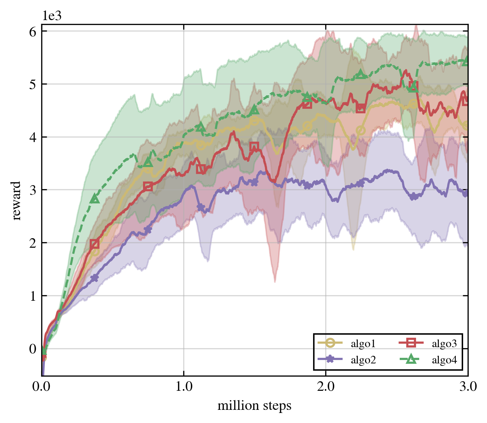

# Make-Figure-For-Scientific-Paper

## Example Data Relative Path Structure
The relative path is organized as "./task/algo/domain/seed/progress.csv".

The design intuition of this path structure is that we want to collect data for one task and draw figure for single task. The second layer path is designed as “algo” rather than “domain” because we usually keep adjusting our algorithm. We look at the algorithm results and may need to switch directories of multiple domains if the second layer is “domain.” The seed directory and the result file name are stripped, and the seed is not used to name the result for better scalability.

In each "progress.csv" file, the data is organized like the following:

1st row: epoch, metric1, metric2

2st row: 0, result1, result2

## Plot Figure

### Line Chart [Final]

### 3D Line Chart [Ongoing]
We are trying to make a nice 3D line chart to show multiple domain results.

